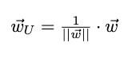
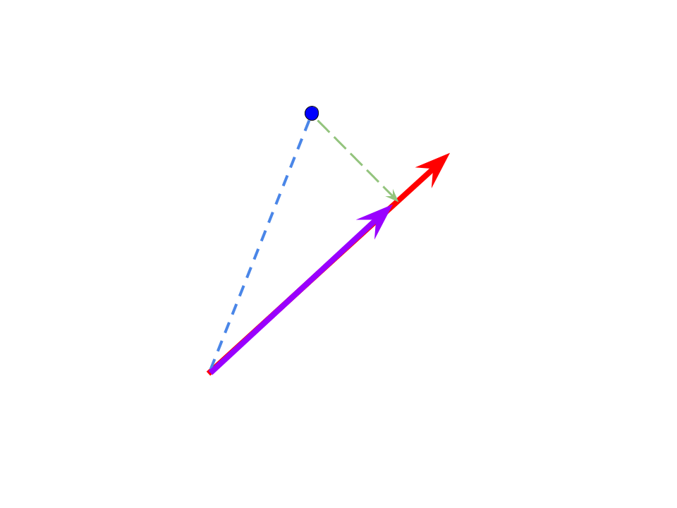

# Homework 4

Welcome to your fourth homework assignment for CSC 294. In this assignment, we will use
gradient descent to gain more intuition on PCA. 

When we introduced PCA in class, we did not delve into the particulars of how and why 
the eigenvectors work to give us orthogonal/perpendicular vectors that note the 
directions of greatest spread. We simply trusted that this process "worked." In this 
assignment, we will use gradient descent to construct our principal components without 
using the covariance matrix and without using eigen-anything. 

**Recommended Labs:** This homework relies on information from Labs 0-6 and Labs 10-11. 

## Question 0: Mean centered data

While we won't be computing eigen-information in this homework, we will need to mean center our data. In other words, we need to move our data so that it is centered at the origin (which is the point where each coordinate is 0). 

Write a function `remove_mean` that takes in an array with $n$ columns and centers the data at the origin. **Note:** In this function you are *not* adjusting the spread of the data. 

## Question 1: Unit Vectors, Directions and Projections

Before we embark on our ascent, we begin with two asides. The first focuses on 
encoding direction. In PCA, we want to find the best view of our data in some 
lower dimension. This can be thought of as finding the set of orthogonal (i.e. 
perpendicular) vectors that represent the directions of greatest spread. 
   
1. In pursuit of the best direction, we will require that the vector 
representing a direction of unit length. 
2. We then will view our data along this direction and check how much of the 
data's spread is captured in this view. 

This question establishes two helper functions, one for each of the above 
steps. The first is `unit_direction`, which scales a vector such that it is 
of length 1. The second function is `project_data` that projects a data point 
onto a vector of unit length. 

### Part A: Unit Directions

For `unit_direction`, our goal is to take in a vector **w** and return a 
vector **w_U** that is **w** scaled to be unit-length. That is:

Hint: See lab 11 for discussion on the `norm` of vectors.  

We recall that the length of a vector is equivalent to taking the square 
root of the dot product of the vector with itself. Additionally, we note 
that a unit-vector will have length (also known as norm) equal to 1. 

_Note:_ your vectors should be stored as arrays. 

### Part B: Projecting one point onto an unit vector

One way to think about viewing data along a particular direction is to consider 
the _projection_ of our data onto the vector representing that direction. In fact, 
for any two vectors (or arrows), we can _project_ one onto another. The length of 
this projection encodes how much of how much of one vector is explained by the other.

Consider for example the below image with a red arrow and a blue dot with a blue 
vector heading towards it. We might want to know how much of the blue vector is 
explained by the red vector and what is not (as shown as the green vector). In the 
vector sense, we can either travel to the blue dot via the blue line or by adding a 
trip on the red vector for a time and then on the green vector. 

The _projection_ of the blue vector onto the red vector is the purple vector. 
Additionally the end of the purple vector is the projection of the blue dot onto the 
red vector, and is where the blue dot would be in a 1-dimensional representation of 
it with the red vector acting as the axis. 

For `project_datapoint`, we will keep the above picture in mind. The input for 
`project_datapoint` will be a (blue) point and a (red) unit-vector. Treating the point as a 
vector that originates at the mean (or the origin, which is the point of all zeros) 
which is also where the vector originates. A few fun facts to get you started:
* The length of the projection of blue vector onto red vector is given by the _dot_ 
product of the blue vector with the red vector (or, the sum of the element-wise 
multiplication of the two vectors) divided by the length of red vector. 
* The length of a vector can be computed by taking the square root of the dot product 
of the vector with itself. 
* The projection of blue vector onto red vector is in the same direction of red, but 
for the length of the projection (of blue onto red).  
* Both input vectors should be of the same dimension (i.e. the same number of coordinates). The output should also be of the same dimension as the inputs.

Your function should check that the second input is a unit vector. You may find it 
helpful to leverage the fact that the second input is of unit length. 

You will test that this functions 'works' in two ways:   
 1. First, create a few examples on paper where you know the answer. I recommend projecting points onto unit vectors that represent the axes; for examples (1,0,0) or (0,0,1,0). Then in the jupyter notebook `hw4-notebook`, import your `hw4.py` file and test your handwritten examples against your code.   
 2. Second, use the unit tests in `test-hw4.py` as usual. 

### Part C: Project (mean-centered) Dataset onto an unit vector

In this last part extend what you wrote in `project_datapoint` to project your entire (mean-centered) dataset onto the same unit vector in the function `project_data`. That is, you will project each data point in your dataset all onto the same unit vector. 

The inputs should be the dataset (as an array) followed by the unit vector that you will project your data onto. The output should the same size as the original data. 

## Question 2 - Evaluation Metric

The goal of PCA is to find the orthogonal/perpendicular vectors that sequentially represent the best 1-dimensional representation of our data, then 2-dimensional representation of our data, then 3-dimensional representation of our data, and so on. For this homework, we will only focus on the first principal component, which is the best one-dimensional representation for our (mean-centered) data. 

There are two equivalent ways to think about this "best" representation. That is, the first principal component is: 
 * _The direction of greatest spread:_ The technical term for spread is "variance" and 
encodes how much variation there is, in this case among our projected data. More 
concretely, the first component of PCA represents the direction of greatest 
variation for data after being projected onto the (unit-)vector representing 
that direction.   
 * _The direction that best represents the data:_ More concretely, if we represent our data as the result of being projected onto the first component, then those representations are closest to the original data. 

This second view is what we will use in this homework. For this question, please complete `mse_n_dim` that computes the mean-squared error between two arrays (each with n columns): the mean-centered data (`data_mc`) and an approximation/representation of that data (`data_rep`). To do this, you will compute the **squared** Euclidean distance between each point in `data_mc` and its representation in `data_rep` and then take an average of your computed **squared** distances. 

## Question 3 - Experiment with Evaluation Metric

In this question, you will experiment with this evaluation metric as well as the idea of variance of projection. 

Begin by plotting your mean-centered data. List three directions that you would like to project your (mean-centered) data onto. Your three possible directions for projection should represent:  
 1. A reasonable direction for "best" spread  
 2. An odd direction for "best" spread  
 3. The worst direction for "best" spread you can guess at. 

Create one plot in `hw4-notebook` with your mean-centered data and these three vectors (each in a different color). Then use your functions from the previous questions to do the following to each projection possibility:  
 1. Project your data onto the chosen vector 
 2. Compute the MSE for the projected data as a representation for your data 
 3. Use `var_dataproj` which computes the variance for your data projections

What do you notice about MSE and variance for your best guess compared to the other two points? Explain how your picture with these computed evaluation metrics relate to the two views of PCA detailed above. 

## Question 4 - Gradient Descent for PCA

In this question, we will find the first principal component for our (mean-centered) data using gradient descent, with MSE as our evaluation metric. Here the parameters that we are seeking are the coordinates of the direction vector that we should project our data onto. That is, we want to find the best vector **p** = (p_1,p_2) such that our 2-D data is projected onto **p** is the best 1-D representation for our data. This means that the values of _p_1_ and _p_2_ are what we are seeking. 

Using code and ideas from the previous two questions, as well as your code from 
Labs 10 and 11, create a function `first_comp` that uses gradient descent to 
determine the first principal component for the dataset. In your implementation, 
use a fixed learning rate. Your implementation should have two 
stopping conditions, stopping after:     
1. A max number of steps, or 
2. When the gradient becomes small enough  

Once you have the first component, you can project each datapoint to the vector 
defined by that component. The collection of these projections is the best 
1-dimensional view of our data. 

To summarize, your code should take in the (mean-centered) data and a max number of steps. 
Then beginning with a random directional vector, you will use gradient descent to find 
(and then return) the first component and the projection of your data onto that found component. 
Note that `grad_var` which computes the gradient has already been written. 

## Question 5 - Verify your PCA Implementation

Compare your implementation from question 4 to the PCA implementation in `sklearn` 
on the `justtwo` data set. A few notes:  
 * Your comparison will only look for the first component from PCA.  
 * Your comparison should include both numerical and visual elements. 
 * You will need to fully standardize your data to use the PCA implementation in `sklearn`, which means that for a true comparison, you need to also standardize your data before using your implementation. 

## Question 6 - Reflecting on PCA

In 1 to 2 paragraphs in your jupyter notebook, explain what is clearer to 
**_you_** about PCA after this homework. 

## Question 7 - All Tests passing

Lastly, we want to check that our functions work against the provided tests. To 
do this, please copy your defined functions into `hw4.py` and then perform unit
tests as usual. Submit screenshots of your tests passing locally and on travis. 

|  Q  | Topic                         | No Attempt | Partial | Complete | 
|-----|-----------------------------  |------------|---------|----------|
|  0  | Create mean centerered data   |            |         |          |  
|  1  | Create a Unit Vector          |            |         |          |   
| ... | Project individual points     |            |         |          |  
| ... | Project a whole dataset       |            |         |          |
|  2  | Develop MSE                   |            |         |          |
|  3  | Experiment with Evaluation    |            |         |          | 
| ... | Discuss your results (x3)     |            |         |          |
|  4  | Create gradient descent       |            |         |          |
|  5  | Compare code from Questin 4   |  --------- |  ------ |  ------  |
| ... |    to `sklearn` version       |            |         |          |               
|  6  | Reflect on PCA                |            |         |          |
|  7  | Local tests                   |            |         |          |
| ... | GitHub Actions                |            |         |          |

|  Q  | Topic                         | Have questions about| Could again without help | 
|-----|-----------------------------  |---------------------|--------------------------|
|  0  | Create mean centerered data   |                     |                          |  
|  1  | Create a Unit Vector          |                     |                          |
| ... | Project individual points     |                     |                          |
| ... | Project a whole dataset       |                     |                          |
|  2  | Develop MSE                   |                     |                          |
|  3  | Experiment with Evaluation    |                     |                          |
| ... | Discuss your results (x3)     |                     |                          |
|  4  | Create gradient descent       |                     |                          |
|  5  | Compare code from Questin 4   |  ------------------ |  ----------------------- |
| ... |    to `sklearn` version       |                     |                          | 
|  6  | Reflect on PCA                |                     |                          4|
|  7  | Local tests                   |                     |                          |
| ... | GitHub Actions                |                     |                          |

#### Resources consulted in creating this homework
0. _Data Science from Scratch_ by Joel Grus, 2015. Specifically, pages 134-139.  
1. [Everything you did and didn't know about PCA](http://alexhwilliams.info/itsneuronalblog/2016/03/27/pca/)
2. [`repmat` helpfile](https://numpy.org/doc/stable/reference/generated/numpy.matlib.repmat.html)
3. [`multiply` helpfile](https://numpy.org/doc/stable/reference/generated/numpy.multiply.html)

